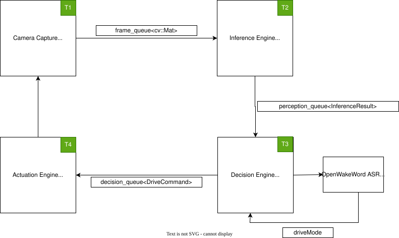

Colab for training wake word ONNX models

https://colab.research.google.com/drive/1q1oe2zOyZp7UsB3jJiQ1IFn8z5YfjwEb#scrollTo=qgaKWIY6WlJ1

## Full pipeline recording

Run `./run.sh`, choose `11) Full Pipeline`, and answer `y` to the recording
prompt. Alternatively, run `./build/pipeline --record` after building. Each
recorded run creates a unique directory under `results/full_pipeline/` with:

- `annotated.mp4`: every frame that completed object and depth inference,
  with detection boxes and a relative-depth panel. It is H.264 video rather
  than a directory of PNGs.
- `frames.csv`: each video's zero-based frame index and its processing time
  in Unix milliseconds. The video plays at a fixed 10 fps; use the CSV for
  actual timing if inference ran faster or slower.
- `pipeline.log`: timestamped output from the camera, inference, decision,
  motor, and RC stages, including stderr. T3 reports when a person appears or
  disappears in any drive mode. T4 reports meaningful command changes and a
  watchdog stop once per loss of active motion.
- `wake_word.log`: Python wake-word output when launched through `run.sh`.

Recording requires OpenCV with an H.264 (`avc1`) encoder. If the video cannot
be opened, the pipeline exits before motors start. The recorder uses a bounded
queue and slows inference if encoding cannot keep up, so frames that finish
inference are not discarded by the recorder. Camera frames may still be
dropped by the existing capture queue when inference is slower than capture.

To check the recorder without robot hardware, run `./run.sh` and select
`12) Pipeline recorder test`. The test prints the temporary directory holding
its sample video, timestamps, and log.
Option `13) Person presence event test` checks detection, brief missed frames,
loss, and reacquisition without robot hardware.
